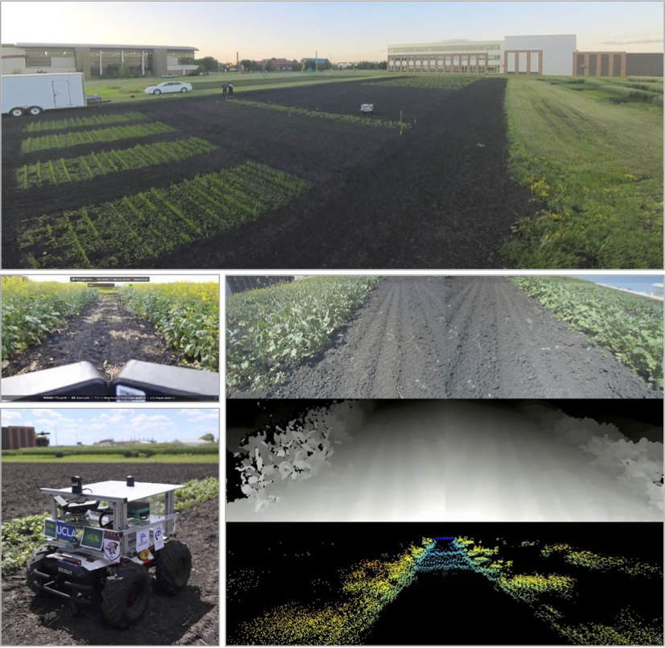
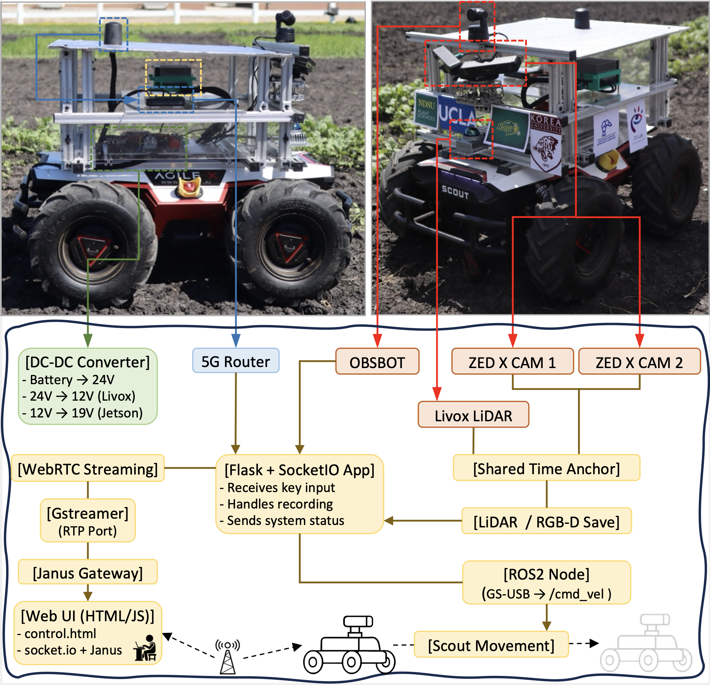

# AgriChrono: A Multi-modal Dataset Capturing Crop Growth and Lighting Variability with a Field Robot

## 1. Project Overview

<table>
<tr>
<td width="60%" valign="top">

- **Duration**: July 2–31, 2025  
- **Location**: NDSU Experimental Field, Fargo, ND
- **Objective**: Capture time-aligned RGB-D, LiDAR, and IMU data across three crop sites under realistic outdoor conditions
- **Focus Sites**: 
  - **Site 1**: Primary canola site, with repeated daily captures across growth stages and lighting variations
  - **Site 2**: Canola genotype trial with 44 varieties for morphological diversity
  - **Site 3**: Flax trial site with structural variability from differing weed control strategies

</td>
<td width="40%">



</td>
</tr>
</table>

<td width="100%">
  <div style="display: flex; flex-direction: row; gap: 4px;">
    
    
    
  </div>
</td>

---

## 2. System Resources
We provide detailed documentation and source code used throughout the **AgriChrono** project for hardware integration, software control, and data processing.

<table>
<tr>
<td width="60%" valign="top">

- 📄 [**Hardware Documentation**](hardware/README.md)  
Describes the robot platform, sensor layout, power system, and networking for stable long-term deployment in the field.
- ⚙️ [**Software Stack**](software/README.md)  
Includes control interfaces, real-time streaming modules, and logging mechanisms used during data collection.
- 🧪 [**Data Extraction Scripts**](data_extract/README.md)  
Codebase for extracting RGB, Depth, and LiDAR data from raw SVO and binary files into structured datasets.
- 💾 [**Download AgriChrono Dataset**](https://ucla.box.com/s/4hrz2mh675ack6aukwwqq2ufige5dti6)  
Public release of the full dataset, including raw and extracted RGB-D, LiDAR, and IMU recordings collected under real-world field conditions.

</td>
<td width="40%">



</td>
</tr>
</table>

---

## 3. Field Layout

<p align="center">
  
</p>

**Main Field Structure**:
- `Site 1`: Regular Canola (main target crop)
- `Site 2`: Canola Genotype Trial
- `Site 3`: Flax Trial

---

## 4. Data Collection Protocol

### 📆 Collection Periods

| Phase       | Dates           | Frequency             | Purpose                                       |
|-------------|------------------|------------------------|-----------------------------------------------|
| Phase 1     | July 2–21        | 4× daily, 7 days/week | Active growth tracking & lighting variation   |
| Phase 2     | July 22–31       | 4× daily, 2 days/week | Growth slowed (near maturity), reduced need   |

---

### 🧪 Site-wise Collection Frequency

| Site   | Description                   | Sessions per Day | Days per Week  | Period           |
|--------|-------------------------------|------------------|----------------|------------------|
| Site 1 | Main Canola Site              | 4                | 7              | July 2–21        |
|        |                               | 4                | 2              | July 22–31       |
| Site 2 | Canola Genotype Trial (Side)  | 1–2 (selected)   | 2              | July 2–31        |
| Site 3 | Flax Trial (Side)             | 1–2 (selected)   | 2              | July 2–31        |

---

### 🛠 Field Conditions

- ❌ **Rainy days**: Data collection was skipped
- ✅ **Wet soil**: Wooden boards were used to allow UGV traversal without damaging soil/crops
- ☀️ **Lighting Diversity**: Sampling times:
  - 06:00 AM (sunrise)
  - 11:00 AM (late morning / high-angle sun)
  - 04:00 PM (late afternoon / descending sun)
  - 09:00 PM (sunset)

| Sun                        | Mon                        | Tue    | Wed                        | Thu                        | Fri    | Sat    |
|----------------------------|----------------------------|--------|----------------------------|----------------------------|--------|--------|
|                            |                            | **1**  | **2**                      | **3**                      | **4**  | **5**  |
|                            |                            |        | S1 (4)<br>S2 (1)<br>S3 (1) | S1 (3)<br>S3 (1)           | S1 (3) | S1 (2) |
| **6**                      | **7**                      | **8**  | **9**                      | **10**                     | **11** | **12** |
| S1 (4)                     | S1 (4)                     | S1 (4) | S1 (4)                     | S1 (3)<br>S2 (1)<br>S3 (1) | S1 (4) | S1 (4) |
| **13**                     | **14**                     | **15** | **16**                     | **17**                     | **18** | **19** |
| S1 (4)<br>S2 (1)<br>S3 (1) | S1 (4)                     | S1 (4) | S1 (4)                     | S1 (4)<br>S2 (1)<br>S3 (1) | S1 (4) | S1 (4) |
| **20**                     | **21**                     | **22** | **23**                     | **24**                     | **25** | **26** |
| S1 (4)                     | S1 (4)<br>S2 (1)<br>S3 (1) | S1 (1) | S1 (-)                     | S1 (-)                     | S1 (-) | S1 (-) |
| **27**                     | **28**                     | **29** | **30**                     |**31**                      |        |        |
| S1 (-)                     | S1 (-)                     | S1 (-) | S1 (-)                     | S1 (-)                     |        |        |

---

## 5. Site Descriptions

### 🌼 Site 1: Main Canola Site
- **Dimensions**: 50 ft (length) × 3 ft (width), 4 rows per plot with 9-inch row spacing
- **Planting Date**: June 1, 2025
- **Emergence Date**: June 7, 2025 (~6 days after sowing)
- **Variety**: *InVigor L340PC* (Spring Canola Hybrid)
- **First Flowering Date**: July 10, 2025
- **Crop Duration**: 90–110 days
- **Objective**:  
  To comprehensively record how a single canola variety appears across growth stages and varying lighting conditions.  
  *This serves as the core reference site for building a robust RGB-D dataset resilient to changes in time, illumination, and crop development.*

---

### 🌼 Site 2: Canola Genotype Trial Site
- **Design**: 11 blocks, each measuring 44 ft × 3 ft
- **Genetic Lines**: 44 different canola genotypes per block
- **Planting Date**: May 30, 2025
- **Objective**:  
  To examine morphological variation across diverse canola genotypes using a large number of distributed plots.  
  *This enables exploration of crop-level diversity essential for robust 3D modeling and perception systems.*

---

### 🌿 Site 3: Flax Trial Site
- **Design**: 4 blocks × 4 plots = 16 total plots
- **Plot Size**: 8 ft × 3 ft per plot
- **Planting Date**: May 30, 2025
- **Variety**: *Gold ND* (Open-Pollinated Flax Cultivar)
- **Crop Duration**: 90–120 days
- **Weed Control Treatments**:
  - 3 blocks sprayed with herbicide using a robot
  - 1 block hand-weeded
- **Objective**:  
  To compare structural patterns of flax under different weed control treatments in a multi-plot setting.  
  *This trial supplements the dataset with structural diversity across crop type and site layout, supporting broader training scenarios.*

---

## 6. Data Structure

### Raw data format (`raw_data/[site]/[timestamp]/`)


```swift
[timestamp]/
├── LiDAR/
│   ├── imu_sync.bin              ← Raw IMU data from Mid-360 LiDAR
│   ├── pointcloud_sync.bin       ← Timestamped LiDAR point clouds (binary)
├── RGB-D/
│   ├── L.svo2                    ← Left ZED X SVO recording
│   ├── L_info.csv                ← Left ZED IMU and timestamp info
│   ├── R.svo2                    ← Right ZED X SVO recording
│   ├── R_info.csv                ← Right ZED IMU and timestamp info
├── sync_time.txt                 ← Global time sync info (ZED ↔ LiDAR)
```

### Extracted data format (`extracted_data/[site]/`)

```swift
[site]/
├── [timestamp]_RGB.mp4           ← 4 RGB views: L_L, L_R, R_L, R_R
├── [timestamp]_Depth.mp4         ← RGB + Depth views: L_L_RGB, R_L_RGB, L_L_Depth, R_L_Depth
├── [timestamp]_Lidar.mp4         ← RGB + Depth + LiDAR point clouds
├── [timestamp].tar.gz            ← Compressed archive of the extracted [timestamp]/ folder
```

### Extracted session folder (`extracted_data/[site]/[timestamp]/`)

```swift
[timestamp]/
├── depth_npz_L/                  ← Depth (.npz) aligned to L_L camera
│   ├── 00000.npz
├── depth_npz_R/                  ← Depth (.npz) aligned to R_L camera
│   ├── 00000.npz
├── depth_png_L/                  ← Depth visualization (.png), aligned to L_L
│   ├── 00000.png
├── depth_png_R/                  ← Depth visualization (.png), aligned to R_L
│   ├── 00000.png
├── frame_L/                      ← PNG RGB frames from left ZED X
│   ├── L_00000.png               ← L_L: left sensor of left ZED X
│   ├── R_00000.png               ← L_R: right sensor of left ZED X
├── frame_R/                      ← PNG RGB frames from right ZED X
│   ├── L_00000.png               ← R_L: right sensor of left ZED X
│   ├── R_00000.png               ← R_R: right sensor of left ZED X
├── lidar/
│   ├── fov150                    ← LiDAR point clouds cropped to match ZED X stereo FoV (~150°)
│   │   ├── 00000.ply             ← LiDAR point cloud for frame 0
│   ├── fov360                    ← Full-range LiDAR point clouds (raw 360° FoV)
│   │   ├── 00000.ply             
│   ├── lidar_info.csv            ← Per-frame timestamp and IMU data from LiDAR
├── zed_info.csv                  ← Per-frame timestamp and IMU data from ZED L and R
```

### CSV Format Overview

#### `zed_info.csv`

| Column                     | Description                                         |
|----------------------------|-----------------------------------------------------|
| `L_frame_id`, `R_frame_id` | Matched frame IDs from left/right ZED              |
| `L_timestamp`, `R_timestamp` | Absolute timestamps (in seconds)                 |
| `relative_time`           | Time elapsed from the first ZED frame (starts at 0.0) |
| `L_*`, `R_*`              | IMU data from each ZED (accel_x/y/z, gyro_x/y/z)    |

#### `lidar_info.csv`

| Column          | Description                                      |
|------------------|--------------------------------------------------|
| `frame_id`      | Frame index aligned with ZED relative time        |
| `timestamp`     | Relative timestamp (ZED-aligned)                  |
| `accel_*`, `gyro_*` | IMU data from LiDAR at the corresponding time |
