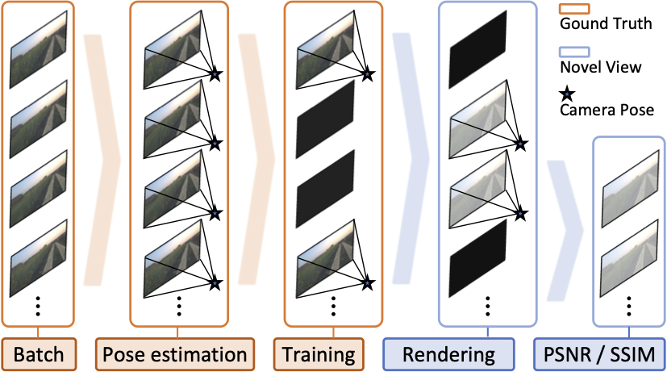
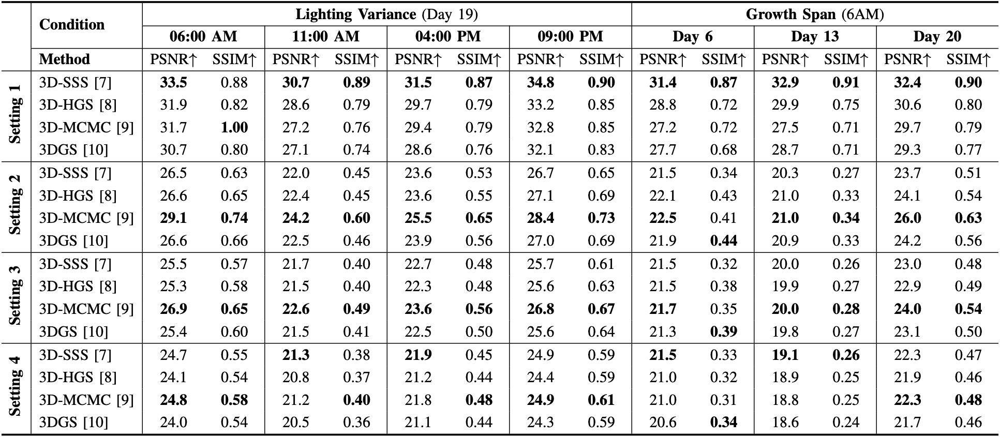

# 📊 Benchmark & Evaluation

## 1. What is this Benchmark?
We provide a **benchmark built on the AgriChrono dataset** to test **Gaussian Splatting methods** in real-world field conditions.  
Unlike indoor datasets, AgriChrono includes **strong lighting changes** and **temporal crop growth**, making it a realistic stress test.

---

## 2. Benchmark Settings

<table>
<tr>
<td width="60%" valign="top">

We constructed the benchmark using **60-second monocular RGB sequences** (900 frames at 15 FPS, resized to 512×288).  
Each sequence is divided into **10 batches** of 90 frames, from which training sets are sampled at different frame rates:  
- 15 FPS → 90 images  
- 10 FPS → 60 images  
- 5 FPS → 30 images  
- 3 FPS → 18 images  

Evaluation is performed on both **training views (15 FPS)** and **novel views (10, 5, 3 FPS)**, with all camera poses estimated using **VGGT** for robustness in dynamic crop scenes.  

Two benchmark scenarios are considered:  
- **☀️ Lighting Variance**: Captures at 06:00, 11:00, 16:00, and 21:00  
- **🌱 Growth Span**: Captures at 06:00 on Day 6, 13, and 20  

</td>
<td width="40%" valign="top">

  

| Setting | Train FPS | Render FPS | View Type      |
|---------|-----------|------------|----------------|
| 1       | 15        | 15         | Training Views |
| 2       | 10        | 5          | Novel Views    |
| 3       | 5         | 10         | Novel Views    |
| 4       | 3         | 12         | Novel Views    |

</td>
</tr>
</table>

---

## 3. Benchmark Results

### 🔹 Quantitative Results

  

We evaluated four baselines on **PSNR** and **SSIM**:
- **3D-SSS**, **3D-HGS**, **3D-MCMC**, **3DGS**

**Key takeaways**:
- Training views: PSNR in the low 30s (much lower than typical indoor benchmarks)  
- Novel views: further drops under lighting and growth variations  
- Visual results: blur and crop-structure breakages in challenging conditions  

### 🔹 Qualitative Results
- **3D-MCMC** generally achieved **higher scores** than other methods on novel-view evaluation (Settings 2–4).  
- Rendered images look close to ground truth at a glance, but:  
  - **Red arrows** → blurred crop structures (visible even in training views)  
  - **Yellow arrows** → structural breakages, stronger in novel views  

  

---

## 4. Why it Matters
This benchmark provides:
- A **realistic baseline** for outdoor 3DGS  
- A **common testbed** for comparing Gaussian Splatting methods  
- Insights into the **gap between controlled benchmarks and real deployment**
