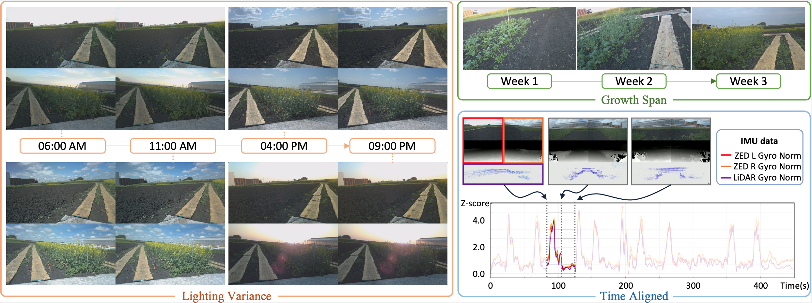

# 💾 AgriChrono Dataset

<p align="center">
  
</p>

This section provides access to the datasets collected with the **AgriChrono platform**, covering diverse **outdoor agricultural conditions** across multiple sites, times of day, and crop growth stages.

---

## 1. Dataset Statistics

| **Site**              | **# Sessions** | **FPS** | **Duration (s)** | **# Samples** | **Size** |
|:----------------------|:--------------:|:-------:|:----------------:|:-------------:|:--------:|
| **Site 1 (CW)**       | 80             | 14.7    | 18,834           | 276,656       | 6.8 TB   |
| **Site 1 (CCW)**      | 80             | 14.7    | 19,098           | 282,919       | 6.9 TB   |
| **Site 2**            | 7              | 13.1    | 10,235           | 129,088       | 3.2 TB   |
| **Site 3**            | 8              | 14.6    | 2,879            | 42,097        | 1.1 TB   |
| **Total**             | **175**        | **14.3**| **51,046**       | **730,760**   | **18 TB**|

Each synchronized multi-modal sample contains:  
- **4 RGB images**  
- **2 depth maps**  
- **1 LiDAR scan**

---

## 2. Available Downloads

- 🌱 [**Samples (512×288)**](https://ucla.box.com/s/00eyzqj6btzlpmsufbg8wmgkz23813r9)  
  Downsampled subset for quick testing and reproducibility.  

- 🌱 [**Samples (1920×1080)**](https://ucla.box.com/s/jo0glrpvt9u6ytioleek12dc1wo74ma2)  
  Original-resolution subset for high-quality experiments.  

- 🖼️ [**Only RGB (Stereo)**](https://ucla.box.com/s/t77te4x3s8nkqale9k8nixe6q9nxo2ii)  
  - **Site 1**: Direction-specific (CW → right ZED only, CCW → left ZED only)  
  - **Sites 2 & 3**: Both left and right ZED sensors included  
  - Contains **only stereo RGB images**, without depth or LiDAR  

- 🌾 [**Full AgriChrono Dataset**](https://ucla.box.com/s/22nonjreia1m16gw9mbjup6f538y4fvo)  
  Complete release including **RGB-D, LiDAR, and IMU recordings** across all sites, times of day, and growth stages.  

---

## 3. Sample Contents

Both **512×288** and **1920×1080** sample sets include three benchmarking subsets:

1. **Field Diversity**  
   - Sites: Site 1 (CW / CCW), Site 2, Site 3  
   - Captures: July 21, 4 PM  
   - Files: `*_RGB.mp4`, `*_Depth.mp4`, `*_Lidar.mp4`, plus `.tar.gz` archives  

2. **Growth Span**  
   - Weeks: Day 6, Day 13, Day 20 (captured at 6 AM)  
   - Files: `week_*_RGB.mp4`, `week_*_Depth.mp4`, `week_*_Lidar.mp4`, plus `.tar.gz` archives  

3. **Lighting Variance**  
   - Times: **06:00, 11:00, 16:00, 21:00**  
   - Captures: July 19, Site 1 (CCW direction)  
   - Files: `time_RGB.mp4`, `time_Depth.mp4`, `time_Lidar.mp4`, plus `.tar.gz` archives  

---

## 4. Citation

If you use **AgriChrono** in your research, please cite:

```bibtex
@article{AgriChrono2025,
  title    = {...},
  author   = {...},
  journal  = {...},
  year     = {...},
  url      = {...}
}
