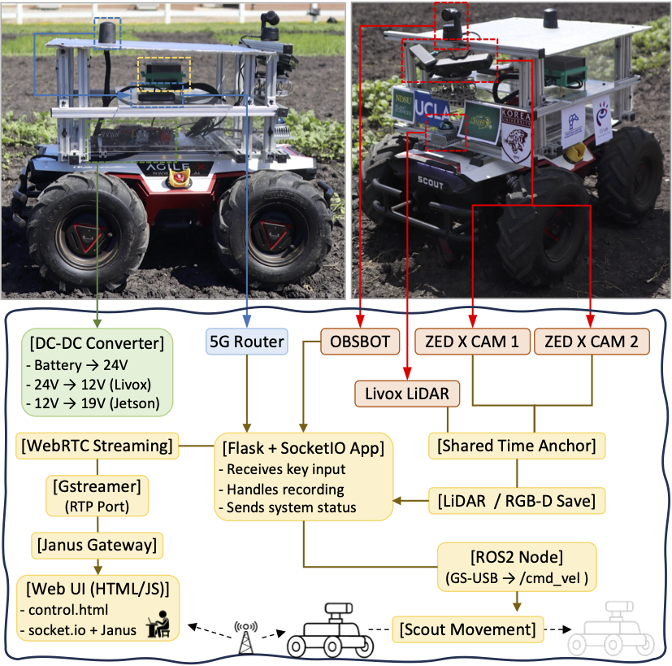

# 🔧 Hardware Overview

<table>
<tr>
<td width="50%" valign="top">
Our robotic platform is purpose-built for long-term deployment in real outdoor farmland environments. 
It is engineered to withstand prolonged sun exposure, fluctuating weather, and uneven terrain, enabling stable integration of multiple sensors under field conditions. 
The system operated reliably for 4 consecutive weeks in summer field trials, performing four data collection sessions per day under temperatures exceeding 100°F. 
This validated its durability, thermal stability, and sensing reliability for continuous RGB-D and LiDAR data acquisition under dynamic outdoor conditions.

</td>
<td width="50%">

</td>
</tr>
</table>

---

## 📁 Hardware Modules

| File | Description |
|------|-------------|
| [`01_Power.md`](./01_Power.md) | Power supply and conversion system — including DC step-down and step-up regulators |
| [`02_Sensing.md`](./02_Sensing.md) | Camera systems (ZED X stereo setup, OBSBOT), IMU, and sensor synchronization |
| [`03_Compute.md`](./03_Compute.md) | Edge compute unit setup (Jetson AGX Orin), storage configuration, and thermal considerations |
| [`04_Robots.md`](./04_Robots.md) | Base platform (AgileX Scout 2.0), frame design, passive cooling, and 3D-printed integration |
| [`05_Network.md`](./05_Network.md) | Network configuration for remote control, video streaming, and system monitoring |

---

## 📌 Project Goal

To enable **real-time, high-resolution 3D reconstruction** and **crop-aware autonomous navigation** in outdoor farm settings using a compact, modular, and fully field-deployable robot.

---

## 🧩 System Highlights

- Dual **ZED X stereo cameras** with wide-angle RGB-D capture
- **Livox Mid-360 LiDAR** for dense 360° 3D sensing in outdoor fields
- Remote streaming and control using **OBSBOT 4K** + **Janus WebRTC** over **4×4 MIMO antenna**
- High-performance **Jetson AGX Orin 64GB** for multi-sensor integration and processing
- Modular dual-voltage **DC power system** with robust cabling
- CAN-based control of **4WD Scout 2.0 UGV** with vibration-resistant compute mount
- Sun and heat mitigation via perforated **thermal shielding**

---

## 🚀 Status

✅ Hardware fully integrated  
🔧 Deployment-ready (tested in Fargo field trials)  
📦 All components already owned and validated

---

## 📬 Contact

Feel free to reach out via [GitHub Issues](https://github.com/Gasso21/3D-Farm-Reconstruction/issues) for questions, suggestions, or collaboration inquiries.
